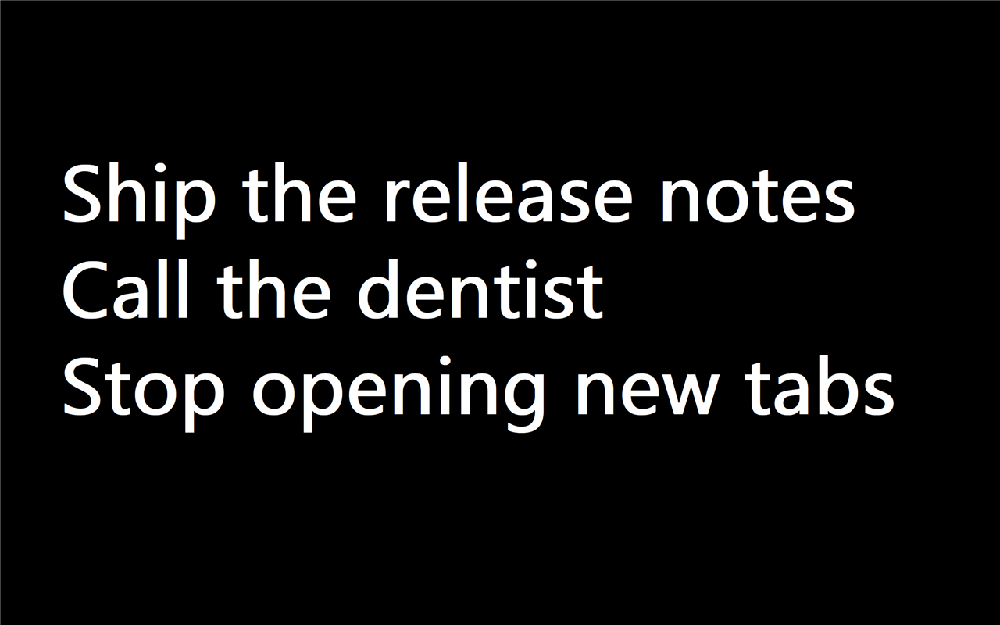

# Blackout

**[English](README.md) · [简体中文](README.zh-CN.md)**

Press `Ctrl + Shift + \`` and your screen goes black, showing today's tasks in
huge white letters. Press `Esc` and it's gone.

It's not a screensaver and it's not another to-do app you'll forget to open.
It's a list that gets in your face on demand, then disappears back into the
tray. For people who know exactly what they should be doing and keep not doing
it.



**132 KB. One executable. No installer required, no runtime, no dependencies.
124 KB of memory sitting in the tray.**

---

## Install

Download from the [latest release](https://github.com/CharlesGuooo/blackout/releases/latest):

| File | Use it if |
| --- | --- |
| `Blackout-x.y.z-Setup.exe` | You want the normal thing — installs for your user only, no admin rights, no UAC prompt |
| `Blackout-x.y.z-portable.zip` | You'd rather unzip one file and run it. Put it anywhere; your list lives next to it |

### Windows will warn you. Here's why, and what to do

SmartScreen will say **"Windows protected your PC"** and refuse to run the
installer. Click **More info → Run anyway**.

This happens because the file isn't code-signed. A certificate costs $200–400
a year, and even then a fresh one gets flagged until it builds up reputation.
This is a free 132 KB utility; that math doesn't work.

If you'd rather verify instead of trust: every release ships `SHA256SUMS.txt`.

```powershell
Get-FileHash .\Blackout-1.0.0-Setup.exe -Algorithm SHA256
```

Compare it with the published hash. You can also read every line of source in
this repo — it's one C file — and build it yourself.

---

## Use it

The first time you open Blackout, the list already has four lines in it. They
tell you how to use the program. Delete them as you learn them.

| Action | What happens |
| --- | --- |
| `Ctrl + Shift + \`` | Show / hide the fullscreen list |
| Just type | Edit it. One line is one task |
| `Enter` | New line — **you decide where lines break; nothing wraps automatically** |
| `Esc` | Save and hide |
| Alt-Tab away | Saves and hides itself |
| Tray icon, left click | Show / hide |
| Tray icon, right click | Show · Open todo.txt · Start with Windows · Quit |

**There is no "mark as done" checkbox, on purpose.** When a task is finished,
delete the line. A to-do list shouldn't be a graveyard of things you already
did.

**Nothing wraps.** One `Enter` is one line on screen. If a task is too long,
every line shrinks to make it fit — that's the app telling you to split it into
two tasks.

The text auto-sizes to fill the screen: 3 tasks render at ~700 px per line,
12 tasks shrink to ~120 px. On a multi-monitor setup it appears on whichever
screen your mouse is on.

Your list is a plain UTF-8 text file called `todo.txt`, sitting next to the
executable. Edit it in Notepad if you like — Blackout reloads it the next time
you open the overlay.

---

## Configure

`todo.ini`, next to the executable. Restart Blackout after editing.

```ini
[hotkey]
mods=ctrl+shift            ; any combination of ctrl / alt / shift / win
key=`                      ; a single character, or a virtual key code like 0xC0

[display]
font=Microsoft YaHei UI
bold=1
minsize=24                 ; smallest font size in pixels
maxsize=400                ; largest font size in pixels
```

**A warning about the default hotkey:** `Ctrl+Shift+\`` is VS Code's "New
Terminal". A global hotkey wins, so VS Code loses that shortcut while Blackout
runs. If you need it back, set `mods=ctrl+alt`, which collides with almost
nothing.

If the hotkey is already taken by another program, Blackout tells you at
startup instead of failing silently.

Data lives next to the executable. If that folder isn't writable — say you
unzipped the portable build into `Program Files` — everything moves to
`%LOCALAPPDATA%\Blackout\` automatically.

---

## Why it's this small

Measured on a 2560×1600 display. **"Working set" is the number Task Manager
shows you** — actual physical memory. "Commit" is reserved address space, most
of which never touches RAM.

| | |
| --- | --- |
| Executable | 132 KB, icon included |
| Sitting in the tray, never opened | **124 KB** working set |
| After you've opened it once | **~3 MB** working set |
| Idle CPU | 0% — no timers, no threads, no keyboard hooks |

For comparison: the same thing built on Electron would be 200–300 MB, and on
C#/WinForms 20–40 MB.

It's plain C against the Win32 API. The fullscreen overlay is one window with
one standard `EDIT` control in it, which is why the caret, text selection, IME
input and undo all just work without a line of code. When you hide the overlay
it calls `SetProcessWorkingSetSize` to hand memory back to the OS.

The one cost it can't avoid: the first time the overlay appears, Windows loads
about 25 DLLs into the process — the DirectWrite/Direct2D text stack, the TSF
input framework, and whatever third-party IME you have installed. Every Win32
program with a text field pays this, and those DLLs never unload.

---

## Build it yourself

Needs Visual Studio 2022 Build Tools with the C++ workload. Nothing else.

```
build.bat
```

Output: `bin\Blackout.exe`. The build locates Visual Studio through `vswhere`,
so it works on any machine and on CI.

### Tests

```
bin\Blackout.exe --selftest                                   22 unit checks
powershell -ExecutionPolicy Bypass -File tools\e2e_test.ps1   45 end-to-end checks
powershell -ExecutionPolicy Bypass -File tools\fallback_test.ps1    9 checks
```

The end-to-end suite drives the real program: it synthesises actual keystrokes
to fire the global hotkey, then screenshots the overlay and asserts on pixels —
it groups rows containing lit pixels into "text bands" and checks the band
count equals the number of lines in the list. A band too few means a line
scrolled off screen; one too many means text wrapped when it shouldn't have.
Geometry assertions can't catch either of those, because the control rectangle
is correct in both cases; it's the content inside that's wrong.

It runs against a copy of the executable in `%TEMP%`, so it never touches your
real `todo.txt`. It does stop every running Blackout instance, because a global
hotkey belongs to exactly one process.

`fallback_test.ps1` covers the read-only-install-directory path by denying
write access to a directory via ACL.

> The `.ps1` files must stay **UTF-8 with BOM**. Windows PowerShell 5.1 decodes
> BOM-less scripts as ANSI, which mangles non-ASCII characters into syntax
> errors.

---

## Limitations

- **It can't cover an exclusive-fullscreen game.** That's a Windows
  restriction; no non-game program can. Windowed and borderless-fullscreen apps
  are covered fine.
- **A long task shrinks all the text**, because the font size has to fit the
  longest line. That's by design — it's the nudge to split it up. Lower
  `minsize` in `todo.ini` if you disagree.
- Needs Windows 10 version 1703 or newer for per-monitor DPI. Older versions
  still run, just without DPI awareness.
- One plain text file. No multiple lists, no tags, no due dates, no sync. Also
  by design: when something goes wrong, Notepad can fix it.

---

## License

MIT — see [LICENSE](LICENSE).
